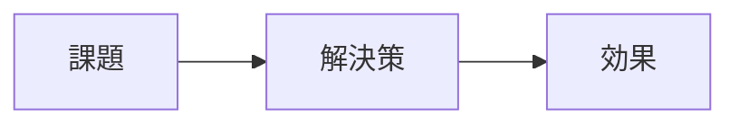

# ドキュメント作成スキル

## 概要

PowerPoint、Word、提案書、報告書などのビジネスドキュメントを
効率的かつ高品質に作成するためのスキルです。

## トリガーワード

以下のキーワードが含まれる場合にこのスキルを使用する:
- 「PPT作成」「スライド作成」「PowerPoint」「PPTX」
- 「SVGスライド」「SVGで作って」「編集可能なスライド」
- 「資料作成」「提案書」「報告書」
- 「ドキュメント作成」「Word」
- 「アジェンダ」「議事録」

## 使用しない場合

- README やコード内コメントの作成
- API ドキュメントの自動生成

## 作成ワークフロー

### Step 1: 要件確認

ドキュメント作成の前に必ず確認する:

| 確認項目 | 質問 |
|----------|------|
| 目的 | 何のためのドキュメント？（提案、報告、教育、共有） |
| 対象読者 | 誰が読む？（経営層、技術者、顧客、社内） |
| 形式 | PPT？Word？Markdown？ |
| ページ数/分量 | 目安は？ |
| トーン | フォーマル？カジュアル？ |
| 期限 | いつまで？ |

### Step 2: アウトライン作成

**必ず内容作成の前にアウトラインを提示し、承認を得る。**

```markdown
## アウトライン案

1. 表紙
2. エグゼクティブサマリー（1枚）
3. 背景・課題（1-2枚）
4. 提案内容（3-5枚）
5. 効果・メリット（1-2枚）
6. スケジュール・ロードマップ（1枚）
7. 次のステップ（1枚）
```

### Step 3: コンテンツ作成

アウトライン承認後、スライドごと / セクションごとに内容を作成する。

---

## PowerPoint スライド作成ルール

### 構造

各スライドは以下の形式で記述する:

```markdown
---
### スライド [番号]: [タイトル]

**キーメッセージ:** [このスライドで伝えたい1文]

**内容:**
- ポイント1
- ポイント2
- ポイント3

**ビジュアル:** [図表・グラフ・画像の説明]

**スピーカーノート:**
[プレゼンで話す内容の補足]
---
```

### デザインディレクション

目指す雰囲気: **Microsoft モダンスライド品質**

> Microsoft の最新のプレゼン資料や Azure マーケティングスライドのような洗練さ。
> 微細なグラデーション、半透明の幾何学装飾、充分な余白、コントラストの効いた配色。
> 「高級コンサルのデリバラブル」であり、「社内勉強会のスライド」ではない。

#### 美的キーワード（生成時に意識する）

- **モダン** — テック企業のプレゼンのような洗練さ。平面的ではなく奥行きがある
- **リッチ** — 安っぽいフラットではなく、微細な装飾とグラデーションで高級感を出す
- **レイヤード** — 半透明の幾何学要素を重ねて深みを作る
- **コントラスト** — ダーク背景ヘッダー × ライト背景コンテンツで視線を導く
- **タイポグラフィ重視** — フォントサイズの差（大タイトル vs 小本文）で階層を作る

#### 装飾の使い方（重要）

微細な装飾で高級感を出す。「何も置かない」のではなく、さりげなく深みを加える。

- **半透明の幾何学シェイプ** — 大きな円やリングを opacity 0.08〜0.15 で背景に配置。端がスライド外にはみ出すくらいがちょうどよい
- **ドットパターン** — 小さな円のグリッドをコーナーに配置（opacity 0.1〜0.2）
- **アクセントライン** — 細いラインや区切り線にアクセント色（#4A8BC2）を使ってメリハリを出す
- **グロー効果** — 装飾円に radialGradient を使い、中心からフェードアウトさせると光の印象が出る

#### グラデーションの使い方（重要）

ベタ塗りの単色背景は平面的でつまらない。**微細なグラデーション**で奥行きと高級感を出す。

SVG では `<defs>` 内に `<linearGradient>` / `<radialGradient>` を定義し、`fill="url(#id)"` で参照する。
svg2pptx.py が自動的に PPTX ネイティブグラデーションに変換する。

##### 推奨グラデーションパターン

| 用途 | タイプ | 開始色 | 終了色 | 方向 |
|------|--------|---------|---------|------|
| タイトルスライド背景 | linear | `#1B2A4A` | `#243660` | 上→下 |
| ヘッダーバー | linear | `#1B2A4A` | `#2B5797` | 左→右 |
| コンテンツ背景 | linear | `#F5F7FA` | `#EEF1F5` | 上→下 |
| 装飾円 | radial | `#4A8BC2` (opacity 0.15) | 透明 | 中心→外 |
| カード背景 | linear | `#FAFBFC` | `#EEF1F5` | 上→下 |

##### SVG グラデーションの書き方

```xml
<defs>
  <!-- 細かい縦グラデ: ダークネイビー → やや明るいネイビー -->
  <linearGradient id="bg-dark" x1="0" y1="0" x2="0" y2="1">
    <stop offset="0%" stop-color="#1B2A4A"/>
    <stop offset="100%" stop-color="#243660"/>
  </linearGradient>

  <!-- ヘッダー横グラデ: ダーク → ディープブルー -->
  <linearGradient id="header-grad" x1="0" y1="0" x2="1" y2="0">
    <stop offset="0%" stop-color="#1B2A4A"/>
    <stop offset="100%" stop-color="#2B5797"/>
  </linearGradient>

  <!-- ライト背景グラデ: ほぼ白 → 淡いグレー -->
  <linearGradient id="bg-light" x1="0" y1="0" x2="0" y2="1">
    <stop offset="0%" stop-color="#F5F7FA"/>
    <stop offset="100%" stop-color="#EEF1F5"/>
  </linearGradient>

  <!-- 装飾用放射グラデ: 中心からフェードアウト -->
  <radialGradient id="glow" cx="0.5" cy="0.5" r="0.5">
    <stop offset="0%" stop-color="#4A8BC2" stop-opacity="0.15"/>
    <stop offset="100%" stop-color="#4A8BC2" stop-opacity="0"/>
  </radialGradient>
</defs>

<!-- 使い方 -->
<rect width="960" height="540" fill="url(#bg-dark)"/>
<rect x="0" y="0" width="960" height="70" fill="url(#header-grad)"/>
<circle cx="800" cy="100" r="200" fill="url(#glow)"/>
```

##### グラデーション使用原則

1. **微細さが命** — 通常は同系色の濃淡差（例: `#1B2A4A` → `#243660`）。色相が変わるグラデはしない
2. **背景と装飾に使う** — テキストボックスやカード内の小さな要素には不要
3. **派手なレインボーグラデ禁止** — 複数の色相をまたぐグラデーションは NG
4. **放射グラデは装飾専用** — グロー効果やライトアクセントとして使う
5. **ストップは最大2つ** — シンプルな2色グラデーションが基本

#### やってはいけないデザイン

- 色のレインボー使い（安っぽくなる）
- 要素の詰め込み（余白なし = 素人感）
- 蛍光色・ビビッド色（#50E6FF, #FF8C00 等）
- すべてのボックスに枠線（うるさくなる）
- **ベタ塗りの単色背景**（平面的でつまらない → グラデーションを使う）
- 装飾のないタイトルスライド（社内勉強会感が出る）
- **派手なレインボーグラデーション**（複数色相をまたぐグラデ = 2010年代感）

### レイアウト原則

- **1スライド1メッセージ** — 詰め込まない
- **箇条書きは最大5点** — 超える場合は分割
- **テキスト量は最小限** — 話す内容はスピーカーノートに
- **図表を優先** — 文章 < 表 < 図 < Mermaid ダイアグラム
- **数字は大きく** — KPI やインパクトは視覚的に強調
- **余白は全体の30%以上** — 左右マージン40px以上、要素間の間隔を十分に取る

### 対象読者別の調整

| 対象 | フォーカス | 避けるべきこと |
|------|-----------|---------------|
| 経営層 | ビジネスインパクト、ROI、リスク | 技術詳細、専門用語 |
| 技術者 | アーキテクチャ、実装、選定理由 | 曖昧な表現、マーケ用語 |
| 顧客 | 課題解決、具体的なメリット | 自社都合の話 |

---

## ドキュメント種別テンプレート

### 提案書
1. 表紙
2. エグゼクティブサマリー
3. 現状の課題
4. 提案するソリューション
5. 期待される効果（定量＋定性）
6. 実施スケジュール
7. 概算費用
8. 体制・サポート
9. 次のステップ

### 技術調査報告
1. 調査の目的
2. 調査範囲と手法
3. 調査結果（サマリー）
4. 詳細分析
5. 比較表（該当する場合）
6. 推奨事項
7. 参考文献

### ワークショップ資料
1. 本日のアジェンダ
2. ゴール設定
3. 前提知識の共有
4. ハンズオン / ディスカッション内容
5. まとめ・次のアクション

---

## 図表の作成

### Mermaid ダイアグラムを積極的に使う



### 使い分け

| 図の種類 | Mermaid 記法 | 用途 |
|----------|-------------|------|
| フローチャート | `graph` | プロセス、ワークフロー |
| シーケンス図 | `sequenceDiagram` | システム間連携 |
| ガントチャート | `gantt` | スケジュール |
| 円グラフ | `pie` | 構成比 |
| マインドマップ | `mindmap` | ブレインストーミング |

---

---

## SVG → PPTX ワークフロー（編集可能なスライド生成）

### 概要

SVG (XML ベース) でスライドを設計し、Python スクリプトで PPTX の**ネイティブシェイプ**に変換する。
画像として貼るのではなく、PowerPoint 上で**テキスト編集・色変更・移動**が可能な状態で出力する。

### なぜ SVG 経由なのか

| 比較項目 | Markdown → 手動転記 | SVG → PPTX 変換 |
|----------|---------------------|-----------------|
| デザイン自由度 | 低（テキスト中心） | 高（座標・色・フォント指定可能） |
| 出力の編集性 | — | ネイティブシェイプで完全編集可能 |
| Copilot との相性 | ◎（テキスト生成） | ◎（SVG もテキスト/XML） |
| 見た目の品質 | 手動次第 | プログラム的に統一 |

### ワークフロー

```
Step 1: Copilot が SVG を生成（スライドごとに1つの SVG）
Step 2: Python スクリプト (svg2pptx.py) で PPTX に変換
Step 3: PowerPoint で微調整（テキスト修正、色変更など）
```

### Step 1: SVG スライド設計ルール

Copilot が SVG を生成するときのルール:

#### スライドサイズ

```
幅: 960px（= 25.4cm、標準 16:9）
高さ: 540px
```

#### 使用する SVG 要素と PPTX マッピング

| SVG 要素 | PPTX でのマッピング | 用途 |
|----------|---------------------|------|
| `<rect>` | AutoShape (Rectangle) | 背景、ボックス、カード |
| `<rect rx="...">` | AutoShape (Rounded Rectangle) | 角丸ボックス |
| `<text>` | TextBox | タイトル、本文、ラベル |
| `<circle>` / `<ellipse>` | AutoShape (Oval) | アイコン背景、装飾 |
| `<line>` | Connector | 区切り線、接続線 |
| `<polygon>` | Freeform Shape | 矢印、カスタム図形 |
| `<g>` | Group Shape | 要素のグループ化 |
| `<defs>` | （定義用） | グラデーション等の定義置き場 |
| `<linearGradient>` | GradientFill (linear) | 線形グラデーション |
| `<radialGradient>` | GradientFill (path) | 放射グラデーション |

#### SVG テンプレート構造

```xml
<svg xmlns="http://www.w3.org/2000/svg" viewBox="0 0 960 540">
  <defs>
    <!-- コンテンツ背景グラデ -->
    <linearGradient id="bg-light" x1="0" y1="0" x2="0" y2="1">
      <stop offset="0%" stop-color="#F5F7FA"/>
      <stop offset="100%" stop-color="#EEF1F5"/>
    </linearGradient>
    <!-- ヘッダー横グラデ -->
    <linearGradient id="header-grad" x1="0" y1="0" x2="1" y2="0">
      <stop offset="0%" stop-color="#1B2A4A"/>
      <stop offset="100%" stop-color="#2B5797"/>
    </linearGradient>
  </defs>

  <!-- 背景（微細グラデーション） -->
  <rect width="960" height="540" fill="url(#bg-light)"/>

  <!-- タイトルバー（横グラデーション） -->
  <rect x="0" y="0" width="960" height="80" fill="url(#header-grad)"/>
  <text x="40" y="52" font-size="28" font-weight="bold"
        fill="#FFFFFF" font-family="Segoe UI">スライドタイトル</text>

  <!-- コンテンツエリア -->
  <text x="40" y="140" font-size="18" fill="#1E2328"
        font-family="Segoe UI">• ポイント1</text>
  <text x="40" y="175" font-size="18" fill="#1E2328"
        font-family="Segoe UI">• ポイント2</text>

  <!-- カード型レイアウト例 -->
  <rect x="40" y="220" width="260" height="160" rx="8"
        fill="#EEF1F5" stroke="#C8CED6"/>
  <text x="60" y="260" font-size="16" font-weight="bold"
        fill="#1E2328" font-family="Segoe UI">カード1</text>
  <text x="60" y="290" font-size="14"
        fill="#4A5568" font-family="Segoe UI">説明テキスト</text>
</svg>
```

#### デザイントークン（カラーパレット）

##### メインパレット（同系色の濃淡で統一）

```
Navy Dark:    #1B2A4A (ダークネイビー — ヘッダー・主要背景)
Navy:         #2B5797 (ディープブルー — 重要要素・強調)
Blue:         #4A8BC2 (ミディアムブルー — サブ要素・ハイライト)
Blue Pale:    #D6E4F0 (ペイルブルー — 薄い背景・カード塗り)
```

##### ニュートラル（テキスト・背景・ボーダー）

```
Background:   #FAFBFC (メイン背景 — ほぼ白)
Surface:      #EEF1F5 (カード・セクション背景)
Border:       #C8CED6 (ボーダー・区切り線)
Text Dark:    #1E2328 (タイトル・見出し)
Text Body:    #4A5568 (本文テキスト)
Text Muted:   #8B939E (補足・注釈)
White:        #FFFFFF (テキストon暗背景)
```

##### アクセント（控えめに使用 — 1スライドに最大1色）

```
Teal:         #2B7A78 (差別化・第2カテゴリ用)
Warm:         #8B6914 (少量の注意喚起ポイント用)
```

##### ステータス色（凡例・アイコン専用 — 本文では使わない）

```
Success:      #2D6A4F (落ち着いた緑)
Warning:      #B8860B (渋いゴールド)
Error:        #9B2C2C (深い赤)
```

#### カラー使用原則

1. **1スライド最大3色** — Navy系 + ニュートラル + (任意で) アクセント1色
2. **濃淡で差をつける** — 異なる色相ではなく、同色系の明暗で区別する
3. **アクセントは面積10%以下** — 小さな要素・アイコン・ラベルにのみ使用
4. **ビビッドな蛍光色は禁止** — 彩度の高い色（#50E6FF, #FF8C00 等）は使わない
5. **レインボー禁止** — 凡例やカテゴリ分けも同系色の濃淡で表現する
6. **ダーク背景ヘッダー + ライト背景本文** — コントラストで高級感を出す

### Step 2: 変換スクリプト実行

```bash
# 変換実行
python scripts/svg2pptx.py slides/ output.pptx

# 個別スライドの変換
python scripts/svg2pptx.py slide01.svg slide02.svg output.pptx
```

変換スクリプトの実体は `scripts/svg2pptx.py`（リポジトリルート）。

### Step 3: PowerPoint での微調整

変換後の PPTX は以下が編集可能:
- テキストの直接編集
- シェイプの色・サイズ変更
- 要素の移動・追加・削除
- アニメーションの追加
- スピーカーノートの編集

### SVG スライドパターン集

#### パターン1: タイトルスライド

```xml
<svg xmlns="http://www.w3.org/2000/svg" viewBox="0 0 960 540">
  <defs>
    <!-- タイトル背景: 縦グラデ（ダークネイビー → やや明るめ） -->
    <linearGradient id="bg-dark" x1="0" y1="0" x2="0" y2="1">
      <stop offset="0%" stop-color="#1B2A4A"/>
      <stop offset="100%" stop-color="#243660"/>
    </linearGradient>
    <!-- 装飾グロー: 中心から半透明フェードアウト -->
    <radialGradient id="glow" cx="0.5" cy="0.5" r="0.5">
      <stop offset="0%" stop-color="#4A8BC2" stop-opacity="0.15"/>
      <stop offset="100%" stop-color="#4A8BC2" stop-opacity="0"/>
    </radialGradient>
  </defs>

  <!-- 背景: 微細グラデーションで奥行き -->
  <rect width="960" height="540" fill="url(#bg-dark)"/>

  <!-- 装飾: グローで光の印象を加える -->
  <circle cx="760" cy="120" r="200" fill="url(#glow)"/>
  <circle cx="820" cy="80" r="120" fill="url(#glow)"/>
  <circle cx="150" cy="480" r="250" fill="url(#glow)"/>

  <!-- ドットパターン（コーナー装飾） -->
  <circle cx="800" cy="200" r="2" fill="#D6E4F0" opacity="0.3"/>
  <circle cx="820" cy="200" r="2" fill="#D6E4F0" opacity="0.3"/>
  <circle cx="840" cy="200" r="2" fill="#D6E4F0" opacity="0.3"/>
  <circle cx="800" cy="220" r="2" fill="#D6E4F0" opacity="0.3"/>
  <circle cx="820" cy="220" r="2" fill="#D6E4F0" opacity="0.3"/>
  <circle cx="840" cy="220" r="2" fill="#D6E4F0" opacity="0.3"/>
  <circle cx="800" cy="240" r="2" fill="#D6E4F0" opacity="0.3"/>
  <circle cx="820" cy="240" r="2" fill="#D6E4F0" opacity="0.3"/>
  <circle cx="840" cy="240" r="2" fill="#D6E4F0" opacity="0.3"/>

  <!-- タイトル -->
  <text x="80" y="220" font-size="36" font-weight="bold"
        fill="#FFFFFF" font-family="Segoe UI">プレゼンテーションタイトル</text>

  <!-- アクセントライン -->
  <line x1="80" y1="245" x2="300" y2="245"
        stroke="#4A8BC2" stroke-width="3"/>

  <!-- サブタイトル -->
  <text x="80" y="290" font-size="20"
        fill="#4A8BC2" font-family="Segoe UI">サブタイトル</text>

  <!-- 補足情報 -->
  <text x="80" y="330" font-size="14"
        fill="#8B939E" font-family="Segoe UI">補足説明テキストをここに</text>

  <!-- 日付 -->
  <text x="80" y="490" font-size="14"
        fill="#8B939E" font-family="Segoe UI">2026年3月</text>
</svg>
```

#### パターン2: 3カラムカード

```xml
<svg xmlns="http://www.w3.org/2000/svg" viewBox="0 0 960 540">
  <defs>
    <linearGradient id="bg-light" x1="0" y1="0" x2="0" y2="1">
      <stop offset="0%" stop-color="#F5F7FA"/>
      <stop offset="100%" stop-color="#EEF1F5"/>
    </linearGradient>
    <linearGradient id="header-grad" x1="0" y1="0" x2="1" y2="0">
      <stop offset="0%" stop-color="#1B2A4A"/>
      <stop offset="100%" stop-color="#2B5797"/>
    </linearGradient>
  </defs>

  <rect width="960" height="540" fill="url(#bg-light)"/>
  <rect x="0" y="0" width="960" height="70" fill="url(#header-grad)"/>
  <text x="40" y="46" font-size="24" font-weight="bold"
        fill="#FFFFFF" font-family="Segoe UI">3つのポイント</text>

  <!-- カード1（濃いブルー） -->
  <rect x="40" y="100" width="270" height="380" rx="8"
        fill="#EEF1F5" stroke="#C8CED6"/>
  <circle cx="175" cy="170" r="35" fill="#1B2A4A"/>
  <text x="175" y="178" font-size="24" fill="#FFFFFF"
        font-family="Segoe UI" text-anchor="middle">1</text>
  <text x="175" y="240" font-size="18" font-weight="bold"
        fill="#1E2328" font-family="Segoe UI"
        text-anchor="middle">ポイント1</text>
  <text x="60" y="280" font-size="14"
        fill="#4A5568" font-family="Segoe UI">説明テキストを</text>
  <text x="60" y="300" font-size="14"
        fill="#4A5568" font-family="Segoe UI">ここに記載する</text>

  <!-- カード2（ミディアムブルー — 同系色の濃淡で差別化） -->
  <rect x="345" y="100" width="270" height="380" rx="8"
        fill="#EEF1F5" stroke="#C8CED6"/>
  <circle cx="480" cy="170" r="35" fill="#2B5797"/>
  <text x="480" y="178" font-size="24" fill="#FFFFFF"
        font-family="Segoe UI" text-anchor="middle">2</text>
  <text x="480" y="240" font-size="18" font-weight="bold"
        fill="#1E2328" font-family="Segoe UI"
        text-anchor="middle">ポイント2</text>

  <!-- カード3（ライトブルー — 同系色で統一） -->
  <rect x="650" y="100" width="270" height="380" rx="8"
        fill="#EEF1F5" stroke="#C8CED6"/>
  <circle cx="785" cy="170" r="35" fill="#4A8BC2"/>
  <text x="785" y="178" font-size="24" fill="#FFFFFF"
        font-family="Segoe UI" text-anchor="middle">3</text>
  <text x="785" y="240" font-size="18" font-weight="bold"
        fill="#1E2328" font-family="Segoe UI"
        text-anchor="middle">ポイント3</text>
</svg>
```

#### パターン3: 比較表

```xml
<svg xmlns="http://www.w3.org/2000/svg" viewBox="0 0 960 540">
  <defs>
    <linearGradient id="bg-light" x1="0" y1="0" x2="0" y2="1">
      <stop offset="0%" stop-color="#F5F7FA"/>
      <stop offset="100%" stop-color="#EEF1F5"/>
    </linearGradient>
    <linearGradient id="header-grad" x1="0" y1="0" x2="1" y2="0">
      <stop offset="0%" stop-color="#1B2A4A"/>
      <stop offset="100%" stop-color="#2B5797"/>
    </linearGradient>
    <linearGradient id="col-left" x1="0" y1="0" x2="0" y2="1">
      <stop offset="0%" stop-color="#1B2A4A"/>
      <stop offset="100%" stop-color="#243660"/>
    </linearGradient>
    <linearGradient id="col-right" x1="0" y1="0" x2="0" y2="1">
      <stop offset="0%" stop-color="#2B5797"/>
      <stop offset="100%" stop-color="#3568A8"/>
    </linearGradient>
  </defs>

  <rect width="960" height="540" fill="url(#bg-light)"/>
  <rect x="0" y="0" width="960" height="70" fill="url(#header-grad)"/>
  <text x="40" y="46" font-size="24" font-weight="bold"
        fill="#FFFFFF" font-family="Segoe UI">比較: A vs B</text>

  <!-- 左カラム（ダークネイビーグラデ） -->
  <rect x="40" y="100" width="420" height="50" rx="4"
        fill="url(#col-left)"/>
  <text x="250" y="132" font-size="18" font-weight="bold"
        fill="#FFFFFF" font-family="Segoe UI"
        text-anchor="middle">プランA</text>
  <rect x="40" y="155" width="420" height="40"
        fill="#EEF1F5" stroke="#C8CED6"/>
  <text x="60" y="180" font-size="14"
        fill="#1E2328" font-family="Segoe UI">特徴1の説明</text>

  <!-- 右カラム（ディープブルーグラデ — 同系色で対比） -->
  <rect x="500" y="100" width="420" height="50" rx="4"
        fill="url(#col-right)"/>
  <text x="710" y="132" font-size="18" font-weight="bold"
        fill="#FFFFFF" font-family="Segoe UI"
        text-anchor="middle">プランB</text>
  <rect x="500" y="155" width="420" height="40"
        fill="#EEF1F5" stroke="#C8CED6"/>
  <text x="520" y="180" font-size="14"
        fill="#1E2328" font-family="Segoe UI">特徴1の説明</text>
</svg>
```

---

## 出力ルール

### 保存先

| 成果物の種類 | 保存先 |
|-------------|--------|
| 提案書・報告書・議事録（Markdown） | `output/documents/YYYY-MM-DD_ドキュメント名/document.md` |
| SVG スライド | `output/slides/YYYY-MM-DD_スライド名/slide01.svg` 〜 |
| 変換後 PPTX | `output/slides/YYYY-MM-DD_スライド名/output.pptx` |
| 調査結果 | `output/research/YYYY-MM-DD_テーマ名/report.md` |

### 重複回避ルール

出力先ディレクトリが既に存在する場合、**上書きせず** サフィックスを付与する:

```
output/slides/2026-03-03_ACA-ネットワーク/       ← 既存
output/slides/2026-03-03_ACA-ネットワーク_v2/    ← 2回目
output/slides/2026-03-03_ACA-ネットワーク_v3/    ← 3回目
```

**手順:**
1. ファイル作成前に、対象ディレクトリの存在を確認する
2. 存在する場合は `_v2`, `_v3`, ... のサフィックスを付けた新規ディレクトリに出力する
3. 既存ファイルは絶対に上書き・削除しない

### 品質基準

- 日本語で作成する
- そのまま使える品質を目指す
- 具体的な数字・事実を優先する（「多くの」ではなく「80%の」）
- 各セクションの分量バランスを意識する
- ドキュメントの最後に情報源一覧を入れる

### SVG 出力時の追加ルール

- スライドサイズ `960x540` を厳守する
- デザイントークンのカラーパレットに従う（メインパレット + ニュートラルが基本）
- **カラー使用原則を必ず守る** — 1スライド最大3色、濃淡で差をつける、レインボー禁止
- **グラデーション必須** — 背景やヘッダーはベタ塗りでなく `<defs>` にグラデーションを定義して `fill="url(#id)"` で参照する
- **`<defs>` を SVG の先頭に置く** — グラデーション定義はすべて `<defs>...</defs>` 内にまとめる
- アクセント色（Teal / Warm）は明確な意図がある場合のみ使用する
- ファイル名は `slide01.svg`, `slide02.svg`, ... の連番
