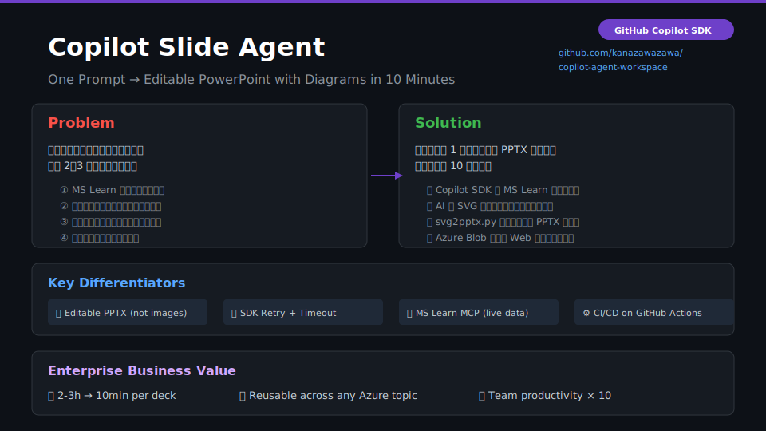
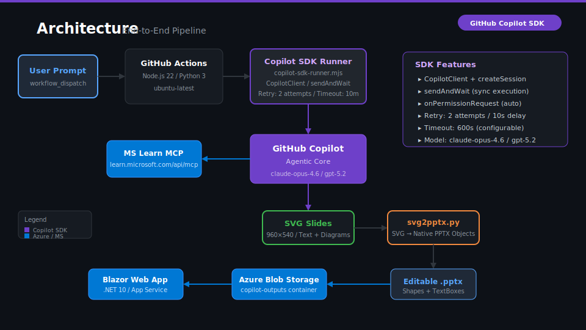
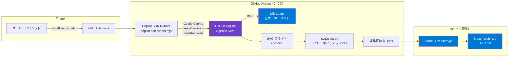

# Copilot Slide Agent

**One prompt → 10 minutes → Editable PPTX with diagrams.**

GitHub Copilot SDK を使い、自然言語プロンプトから **編集可能な PowerPoint スライド** を自動生成するエージェントです。  
顧客向け技術スライドの作成にかかる **2〜3 時間の作業を約 10 分** に短縮します。

---

## なぜ作ったか

| Before | After |
|--------|-------|
| MS Learn を手動で検索 | Copilot が MCP 経由で公式ドキュメントを自動取得 |
| PowerPoint でゼロからスライドを構築 | SVG → ネイティブ PPTX に自動変換（テキスト編集可能） |
| 1 デッキに 2〜3 時間 | プロンプト入力 → 約 10 分で完成 |
| 品質にばらつき | スキル定義でデザイン・構成ルールを統一 |

---

## スライド例

このエージェントが生成するスライドのサンプルです（SVG → 編集可能な PPTX に自動変換されます）。





---

## アーキテクチャ



1. ユーザーが自然言語プロンプトを入力（Web UI or GitHub Actions 手動実行）
2. **Copilot SDK**（`@github/copilot-sdk`）がエージェントセッションを開始
3. Copilot が **MS Learn MCP サーバー** で公式ドキュメントを調査 → **SVG スライド** を生成
4. `svg2pptx.py` が SVG 要素を **ネイティブ PowerPoint オブジェクト** に変換（図形・テキストボックス — 画像埋め込みではない）
5. 生成された `.pptx` を Azure Blob Storage にアップロード → Web アプリで配布

---

## SDK で使用している機能

| SDK Feature | 用途 |
|-------------|------|
| `CopilotClient` | SDK クライアント初期化（自動トークン検出） |
| `createSession` | モデル選択付きセッション作成（claude-opus-4.6 / gpt-5.2 / o3 等） |
| `sendAndWait` | タイムアウト付き同期プロンプト実行 |
| `onPermissionRequest` | ツール使用許可の自動承認 |
| **リトライ制御** | `COPILOT_MAX_RETRIES` / `COPILOT_RETRY_DELAY` で設定可能なリトライ |
| **タイムアウト制御** | `COPILOT_TIMEOUT_MS`（デフォルト 10 分） |

> SDK Runner のコード: [`scripts/copilot-sdk-runner.mjs`](scripts/copilot-sdk-runner.mjs)

---

## 主要な技術判断

| 判断 | 理由 |
|------|------|
| **中間形式として SVG** | AI はマークアップ生成が得意。SVG は標準テキスト形式で Copilot がネイティブに扱える |
| **画像ではなくネイティブ PPTX オブジェクト** | `svg2pptx.py` が `add_shape()` / `add_textbox()` / `text_frame` に変換。PowerPoint で完全に編集・検索可能 |
| **AI と変換の分離** | AI はコンテンツ（SVG）に集中。変換は決定論的 Python コードで行い、ハルシネーションリスクを排除 |
| **CLI → SDK 移行** | プログラム的制御（リトライ・タイムアウト・パーミッション管理・構造化エラーハンドリング） |

---

## クイックスタート

### GitHub Actions で実行（推奨）

1. **Actions** タブ → **Copilot SDK Runner** → **Run workflow**
2. プロンプトを入力（例: `Azure Cosmos DB の概要をPPTXで作成してください`）
3. モデルを選択（`claude-opus-4.6` 推奨）
4. 完了後、Artifact から `.pptx` をダウンロード

### ローカル実行

```bash
git clone https://github.com/kanazawazawa/copilot-agent-workspace.git
cd copilot-agent-workspace

# Python 依存関係
pip install -r scripts/requirements.txt

# 実行
export COPILOT_GITHUB_TOKEN="ghp_xxx"
export COPILOT_PROMPT="Azure App Service の概要をPPTXで作成してください"
node scripts/copilot-sdk-runner.mjs
```

### 前提条件

- GitHub Copilot Enterprise / Business ライセンス
- Fine-grained PAT（`Copilot Requests` パーミッション）
- Node.js 22+（`@github/copilot-sdk` が `node:sqlite` を使用）
- Python 3.10+ / `python-pptx` / `lxml`
- Azure サブスクリプション（任意 — Blob Storage + Web App 用）

---

## エージェント構成

Copilot の振る舞いを制御する設定ファイル群:

| ファイル | 役割 |
|---------|------|
| [`AGENTS.md`](AGENTS.md) | プロジェクト全体の方針・ワークフロー定義 |
| [`.github/copilot-instructions.md`](.github/copilot-instructions.md) | Copilot の言語・スタイル・出力ルール |
| `.github/skills/` | タスク別の専門知識パッケージ（MS Learn 調査、スライド設計、ドキュメント作成、顧客調査） |
| `.github/instructions/` | ファイルパターン別の品質基準（`applyTo` で自動適用） |
| [`.vscode/mcp.json`](.vscode/mcp.json) | MCP サーバー設定（MS Learn、context7、memory 等 6 サーバー） |

---

## Azure 連携

| サービス | 用途 |
|----------|------|
| **Azure Blob Storage** | 生成済み PPTX ファイルの保管・配信 |
| **Azure App Service** | Blazor Server Web アプリのホスティング（ファイル配布 UI） |

Web アプリ（`webapp/`）はプロンプト入力・ジョブ管理・PPTX の閲覧/ダウンロードを提供する **ファイル配布インターフェース** です。

---

## Responsible AI

- 生成コンテンツは **MS Learn MCP 経由の公式ドキュメント** に基づく（未検証ソースではない）
- 生成スライドは顧客提示前に **人間レビュー** が必要
- 顧客データの処理・保存・送信は **一切行わない**
- ツール使用許可は現在 all-allow ポリシー（本番ではスコープ限定が必要）
- PAT は最小権限（`Copilot Requests` のみ）

---

## プロジェクト構成

```
├── .github/
│   ├── copilot-instructions.md      # Copilot 共通ルール
│   ├── workflows/copilot-poc.yml    # CI/CD パイプライン
│   ├── skills/                      # 4 つの専門スキル
│   └── instructions/                # ファイルパターン別ルール
├── scripts/
│   ├── copilot-sdk-runner.mjs       # SDK ベース Copilot Runner（リトライ付き）
│   ├── svg2pptx.py                  # SVG → ネイティブ PPTX 変換（1,093 行）
│   └── requirements.txt
├── webapp/                          # Blazor Server ファイル配布 UI (.NET 10)
├── docs/                            # 詳細ドキュメント
├── presentations/                   # プロジェクト紹介スライド
├── output/                          # 生成物出力先（.gitignore）
├── AGENTS.md                        # エージェント全体方針
├── .vscode/mcp.json                 # MCP サーバー設定（6 サーバー）
└── README.md                        # ← このファイル
```

> 詳細な技術ドキュメントは [`docs/README.md`](docs/README.md) を参照してください。

---

## 技術スタック

| カテゴリ | 技術 |
|----------|------|
| SDK | `@github/copilot-sdk`（Node.js 22+） |
| スライド変換 | `python-pptx` / `lxml`（SVG → ネイティブ PPTX） |
| CI/CD | GitHub Actions（`workflow_dispatch`） |
| Web アプリ | Blazor Server / .NET 10 / Octokit 14 |
| ストレージ | Azure Blob Storage / Azure App Service |
| MCP | microsoft-docs, context7, memory, github 等 |

---

## ライセンス

MIT
