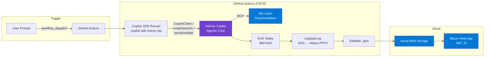
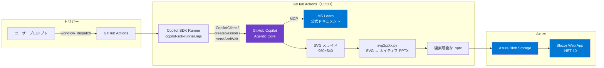

# Copilot Slide Agent — Automated Technical Presentation Generator

## Problem

Technical staff spend **2–3 hours per customer request** creating technical slide decks. The typical workflow involves:

1. Searching Microsoft Learn for up-to-date product information
2. Synthesizing findings into structured talking points
3. Manually building PowerPoint slides with diagrams and formatting
4. Reviewing and iterating for accuracy and visual quality

This repetitive, time-consuming process diverts technical staff from higher-value activities like architecture design and customer engagement.

## Solution

**Copilot Slide Agent** automates the entire research-to-presentation pipeline. A single natural-language prompt triggers an end-to-end workflow:

1. **Research** — GitHub Copilot (via the SDK) queries Microsoft Learn MCP server for authoritative, up-to-date documentation
2. **Generate** — Copilot generates structured SVG slides (960×540) with text, diagrams, and visual elements
3. **Convert** — A deterministic Python script (`svg2pptx.py`) converts SVG elements into **native, editable PowerPoint objects** (shapes, text boxes, styled paragraphs) — not images
4. **Deliver** — The resulting `.pptx` is uploaded to Azure Blob Storage and accessible via a Blazor web app

**One prompt → 10 minutes → Editable PPTX with diagrams.** No manual slide-building required.

## Architecture



### Key Design Decisions

| Decision | Rationale |
|----------|-----------|
| **SVG as intermediate format** | AI generates markup (no library dependencies). SVG is a standard text format Copilot handles natively. |
| **Native PPTX objects (not images)** | `svg2pptx.py` converts SVG elements to `add_shape()`, `add_textbox()`, `text_frame` — output text is fully editable and searchable in PowerPoint. |
| **Separation of AI and conversion** | AI focuses on content creation (SVG); deterministic Python code handles pixel-perfect PPTX conversion. No AI hallucination risk in the conversion step. |
| **SDK over CLI** | Programmatic control: configurable retry, timeout, permission management, structured error handling. |

## Prerequisites

- **GitHub account** with Copilot Enterprise or Copilot Business license
- **Fine-grained PAT** with `Copilot Requests` permission
- **Node.js 22+** (required for `@github/copilot-sdk` — uses `node:sqlite`)
- **Python 3.10+** with `python-pptx` and `lxml`
- **Azure subscription** (optional, for Blob Storage + Web App hosting)

## Setup

### 1. Clone the repository

```bash
git clone https://github.com/kanazawazawa/copilot-agent-workspace.git
cd copilot-agent-workspace
```

### 2. Configure GitHub Secrets

In your repository Settings → Secrets and variables → Actions:

| Secret | Description |
|--------|-------------|
| `COPILOT_FG_TOKEN` | Fine-grained PAT with Copilot Requests permission |
| `AZURE_STORAGE_CONNECTION_STRING` | (Optional) Azure Blob Storage connection string |

### 3. Install Python dependencies

```bash
pip install -r scripts/requirements.txt
```

### 4. Run manually (local)

```bash
export COPILOT_GITHUB_TOKEN="ghp_xxx"
export COPILOT_PROMPT="Azure Cosmos DB の概要を PPTX で作成してください"
node scripts/copilot-sdk-runner.mjs
```

### 5. Run via GitHub Actions

1. Go to **Actions** tab → **Copilot SDK Runner**
2. Click **Run workflow**
3. Enter your prompt and select a model
4. Download the generated PPTX from the workflow artifacts

## Deployment

### GitHub Actions (Primary)

The workflow (`.github/workflows/copilot-poc.yml`) handles the full pipeline:
- Checkout → Node.js 22 setup → SDK install → Copilot execution → Artifact upload → Blob upload

### Azure Blob Storage + Web App (Optional)

- PPTX files are uploaded to Azure Blob Storage container `copilot-outputs`
- A Blazor Server web app (`webapp/`) provides a UI for prompt input, job tracking, and PPTX browsing
- Hosted on Azure App Service (.NET 10)

## SDK Features Used

| Feature | Implementation |
|---------|----------------|
| `CopilotClient` | SDK client initialization with auto token detection |
| `createSession` | Session creation with model selection |
| `sendAndWait` | Synchronous prompt execution with configurable timeout |
| `onPermissionRequest` | Automated tool permission approval (all-allow policy) |
| **Retry with backoff** | Configurable retry attempts (`COPILOT_MAX_RETRIES`) with delay between attempts |
| **Timeout control** | Configurable via `COPILOT_TIMEOUT_MS` (default: 10 min) |
| **Structured logging** | Progress indicators per attempt (`[1/2]`, `[2/2]`) for CI/CD observability |

## Environment Variables

| Variable | Default | Description |
|----------|---------|-------------|
| `COPILOT_GITHUB_TOKEN` | (required) | GitHub PAT with Copilot permission |
| `COPILOT_PROMPT` | (required) | Natural-language prompt |
| `COPILOT_MODEL` | `claude-opus-4.6` | AI model to use |
| `COPILOT_MAX_RETRIES` | `2` | Max attempts (1 = no retry) |
| `COPILOT_RETRY_DELAY` | `10` | Seconds between retries |
| `COPILOT_TIMEOUT_MS` | `600000` | sendAndWait timeout in ms |

## Responsible AI (RAI) Notes

### Content Generation

- All generated content is based on **official Microsoft Learn documentation** accessed via the MS Learn MCP server — not from training data or unverified sources
- Generated slides should be **reviewed by a human** before use in customer-facing presentations
- The system does **not** process, store, or transmit customer data

### Permission Model

- The current implementation uses an **all-allow** policy for tool permissions (`onPermissionRequest` returns `approved` for all requests)
- In production, this should be scoped to specific tools (e.g., file write, MCP read) based on organizational policy

### Data Handling

- No customer PII is processed
- Prompts and outputs are stored in GitHub Actions artifacts (7-day retention) and optionally in Azure Blob Storage
- The Fine-grained PAT uses minimal permissions (`Copilot Requests` only)

### Limitations

- AI-generated diagrams may not always be architecturally accurate — human review is recommended
- SVG→PPTX conversion handles common elements but may not support all SVG features (e.g., complex gradients, filters)
- Response quality depends on the selected AI model and prompt specificity

## Project Structure

```
copilot-agent-workspace/
├── .github/
│   ├── copilot-instructions.md          # Copilot agent behavior rules
│   ├── workflows/
│   │   └── copilot-poc.yml              # CI/CD pipeline (GitHub Actions)
│   ├── skills/                          # Domain knowledge packages
│   │   ├── ms-learn-research/           # MS Learn research methodology
│   │   ├── slide-creator/               # SVG slide design system
│   │   ├── document-writer/             # Markdown document standards
│   │   └── customer-research/           # Customer intelligence
│   └── instructions/                    # File-pattern-specific rules
├── scripts/
│   ├── copilot-sdk-runner.mjs           # SDK-based Copilot runner (Node.js)
│   ├── svg2pptx.py                      # SVG → native PPTX converter (1093 lines)
│   └── requirements.txt                 # Python dependencies
├── webapp/                              # Blazor Server web app (.NET 10)
│   ├── Components/Pages/               # UI: prompt input, job tracking, history
│   └── Services/                        # GitHub Actions API + Blob Storage
├── output/                              # Generated artifacts
│   ├── slides/                          # SVG + PPTX outputs
│   ├── research/                        # Research reports
│   └── documents/                       # Business documents
├── docs/                                # Project documentation
│   └── README.md                        # ← This file
├── AGENTS.md                            # Agent instructions & workspace design
└── .vscode/mcp.json                     # MCP server configuration
```

## License

MIT

---

# 日本語版 / Japanese Version

## 課題

技術スタッフは、顧客からの依頼ごとに技術スライドの作成に **2〜3 時間** を費やしています。典型的なワークフロー:

1. Microsoft Learn で最新の製品情報を検索
2. 調査結果を構造化されたトーキングポイントに整理
3. PowerPoint で図表やフォーマットを手動で作成
4. 正確性とデザインの反復レビュー

この繰り返し作業が、アーキテクチャ設計や顧客エンゲージメントといった高付加価値業務の時間を圧迫しています。

## ソリューション

**Copilot Slide Agent** は、リサーチからプレゼンテーション作成までの全パイプラインを自動化します。自然言語プロンプト1つでエンドツーエンドのワークフローが起動します:

1. **リサーチ** — GitHub Copilot（SDK 経由）が MS Learn MCP サーバーに問い合わせ、公式ドキュメントから正確な情報を取得
2. **生成** — Copilot が構造化された SVG スライド（960×540）をテキスト・図表・視覚要素付きで生成
3. **変換** — 決定論的な Python スクリプト（`svg2pptx.py`）が SVG 要素を **ネイティブで編集可能な PowerPoint オブジェクト**（図形、テキストボックス、スタイル付き段落）に変換 — 画像としての埋め込みではない
4. **配信** — 生成された `.pptx` が Azure Blob Storage にアップロードされ、Blazor Web アプリからアクセス可能

**プロンプト1つ → 10分 → 編集可能な PPTX（図表付き）。** 手動でのスライド作成は不要です。

## アーキテクチャ



### 主要な設計判断

| 判断 | 理由 |
|------|------|
| **中間形式として SVG を採用** | AI はマークアップを生成（ライブラリ依存なし）。SVG は Copilot がネイティブに扱える標準テキスト形式。 |
| **画像ではなくネイティブ PPTX オブジェクト** | `svg2pptx.py` が SVG 要素を `add_shape()`, `add_textbox()`, `text_frame` に変換 — PowerPoint で完全に編集・検索可能。 |
| **AI と変換の分離** | AI はコンテンツ作成（SVG）に集中。PPTX 変換は決定論的な Python コードで行い、変換ステップでの AI ハルシネーションリスクを排除。 |
| **CLI ではなく SDK** | プログラム的制御: 設定可能なリトライ、タイムアウト、パーミッション管理、構造化されたエラーハンドリング。 |

## 前提条件

- **GitHub アカウント** — Copilot Enterprise または Copilot Business ライセンス付き
- **Fine-grained PAT** — `Copilot Requests` パーミッション付き
- **Node.js 22 以上** — `@github/copilot-sdk` が `node:sqlite` を使用するため必須
- **Python 3.10 以上** + `python-pptx`, `lxml`
- **Azure サブスクリプション**（任意、Blob Storage + Web App ホスティング用）

## セットアップ

### 1. リポジトリをクローン

```bash
git clone https://github.com/kanazawazawa/copilot-agent-workspace.git
cd copilot-agent-workspace
```

### 2. GitHub Secrets を設定

リポジトリの Settings → Secrets and variables → Actions:

| Secret | 説明 |
|--------|------|
| `COPILOT_FG_TOKEN` | Copilot Requests パーミッション付き Fine-grained PAT |
| `AZURE_STORAGE_CONNECTION_STRING` | （任意）Azure Blob Storage 接続文字列 |

### 3. Python 依存関係をインストール

```bash
pip install -r scripts/requirements.txt
```

### 4. ローカルで手動実行

```bash
export COPILOT_GITHUB_TOKEN="ghp_xxx"
export COPILOT_PROMPT="Azure Cosmos DB の概要を PPTX で作成してください"
node scripts/copilot-sdk-runner.mjs
```

### 5. GitHub Actions で実行

1. **Actions** タブ → **Copilot SDK Runner**
2. **Run workflow** をクリック
3. プロンプトを入力してモデルを選択
4. ワークフローの Artifact から生成された PPTX をダウンロード

## SDK で使用している機能

| 機能 | 実装内容 |
|------|----------|
| `CopilotClient` | 自動トークン検出による SDK クライアント初期化 |
| `createSession` | モデル選択付きセッション作成 |
| `sendAndWait` | 設定可能なタイムアウト付き同期プロンプト実行 |
| `onPermissionRequest` | ツール使用許可の自動承認（all-allow ポリシー） |
| **リトライ付きバックオフ** | 設定可能なリトライ回数（`COPILOT_MAX_RETRIES`）、リトライ間のディレイ |
| **タイムアウト制御** | `COPILOT_TIMEOUT_MS` で設定可能（デフォルト: 10分） |
| **構造化ロギング** | 試行ごとの進捗表示（`[1/2]`, `[2/2]`）で CI/CD の可観測性を確保 |

## 環境変数

| 変数名 | デフォルト値 | 説明 |
|--------|-------------|------|
| `COPILOT_GITHUB_TOKEN` | （必須） | Copilot パーミッション付き GitHub PAT |
| `COPILOT_PROMPT` | （必須） | 自然言語プロンプト |
| `COPILOT_MODEL` | `claude-opus-4.6` | 使用する AI モデル |
| `COPILOT_MAX_RETRIES` | `2` | 最大試行回数（1 = リトライなし） |
| `COPILOT_RETRY_DELAY` | `10` | リトライ間の秒数 |
| `COPILOT_TIMEOUT_MS` | `600000` | sendAndWait のタイムアウト（ミリ秒） |

## Responsible AI（責任ある AI）に関する注記

### コンテンツ生成

- 生成されるすべてのコンテンツは、MS Learn MCP サーバー経由でアクセスする **公式 Microsoft Learn ドキュメント** に基づいています — トレーニングデータや未検証のソースからではありません
- 生成されたスライドは、顧客向けプレゼンテーションで使用する前に **人間によるレビュー** が必要です
- このシステムは顧客データの処理・保存・送信を **行いません**

### パーミッションモデル

- 現在の実装では、ツール使用許可に **all-allow** ポリシーを使用しています（`onPermissionRequest` がすべてのリクエストに `approved` を返す）
- 本番環境では、組織のポリシーに基づいて特定のツール（例: ファイル書き込み、MCP 読み取り）にスコープを限定すべきです

### データ取り扱い

- 顧客の PII は処理しません
- プロンプトと出力は GitHub Actions Artifact（7日間保持）および、オプションで Azure Blob Storage に保存されます
- Fine-grained PAT は最小限のパーミッション（`Copilot Requests` のみ）を使用

### 制限事項

- AI 生成の図は、アーキテクチャ的に常に正確とは限りません — 人間によるレビューを推奨します
- SVG→PPTX 変換は一般的な要素を処理しますが、すべての SVG 機能（複雑なグラデーション、フィルタなど）には対応していない場合があります
- レスポンスの品質は、選択した AI モデルとプロンプトの具体性に依存します
